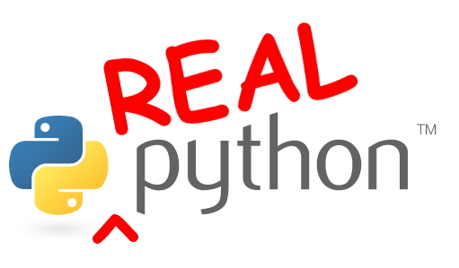

## Flask for Data Science Workshop

(realpython.com)

*Day !*

---

## `whoami`

 

----

### About me

1. Curriculum Developer (former Lead Instructor Full Stack) at [Galvanize](http://www.galvanize.com/)
1. Mentor at [Thinkful](https://www.thinkful.com/)
1. Resume @ [mherman.org](http://mherman.org/)
1. OSS - [discoverflask.com](discoverflask.com), [github.com/mjhea0/](github.com/mjhea0/)
1. 😍 - tech writing, [financial models](http://www.starterfinancialmodel.com/), radiohead, chilling

