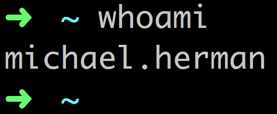

## Web Development for Data Scientists

(realpython.com)

*January 24th, 2017*

---

## `whoami`

 

----

### About me

1. Lead Instructor Full Stack at [Galvanize](http://www.galvanize.com/)
1. Mentor at [Thinkful](https://www.thinkful.com/)
1. Resume @ [mherman.org](http://mherman.org/)
1. OSS - [discoverflask.com](discoverflask.com), [github.com/mjhea0/](github.com/mjhea0/)
1. 😍 - tech writing, [financial models](http://www.starterfinancialmodel.com/), radiohead, chilling

Note: First language was c++ back in high school. Before galvanize, I was freelance for 6 years, focused on web development, web scraping, and business tools. Started working in tech education with Real Python.

---

## Who are you?

- Name
- background
- Something interesting/funny/unique/whatever

---

## About this Workshop

1. **Intro** - about, why web dev, environment setup
1. **Flask** quick start - what, why, setup
1. **Visualization** - bokeh, charts, client-side
1. **Retrieval** - APIs, web scraping, server-side
1. **Interaction** - getting data from your users, client and server

*Learning by doing - short lectures, lots of hacking, homework*
